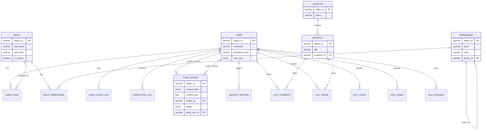

# 后台管理子系统 数据库设计文档 (v1.0)

## 1. 设计概述

### 1.1 数据库定位

本数据库设计服务于 **海外藏中国文物知识管理与服务平台** 的整体数据存储需求，并重点支撑 **后台管理子系统** 的以下功能：

- 角色与权限管理
- 全平台用户统一管理
- 内容审核
- 文物数据与UGC管理
- 数据备份与恢复
- 操作/系统/安全日志
- 系统监控看板（统计查询）
- 系统配置管理

### 1.2 设计原则

- **全局唯一标识**：所有表主键统一使用 `object_id`（UUID v4格式），对外暴露的接口一律使用该字段，符合接口文档规范。
- **全平台统一用户表**：将后台管理员、知识服务子系统用户、掌上博物馆用户纳入同一张 `user` 表，通过 `user_type` 区分，实现用户统一管理。
- **RBAC 权限模型**：采用经典的“用户-角色-权限”五表结构，支持细粒度权限树与动态配置。
- **审核双机制**：支持自动审核规则配置与人工审核队列，审核记录留痕。
- **存储引擎**：事务表使用 InnoDB，字符集默认 `utf8mb4`，支持 emoji 等特殊字符。
- **软删除**：关键业务数据推荐使用逻辑删除（`is_deleted`），便于数据追溯。
- **审计追踪**：所有管理员操作、权限变更、内容审核等均记入对应日志表。

### 1.3 图数据库说明

知识图谱三元组主存储使用 **Neo4j** 图数据库，MySQL 中不冗余存储三元组。后台管理子系统通过应用层直接操作 Neo4j，实现实体/关系的在线编辑与同步。本设计文档仅涵盖关系型数据库部分。

------

## 2. 数据库 ER 图（要点描述）

核心关系说明：

- 一个用户可以拥有多个角色，一个角色可分配给多个用户（多对多）。
- 一个角色可拥有多个权限，一个权限可分配给多个角色（多对多）。
- 权限表自关联（`parent_id`）形成树形结构。
- 文物归属博物馆，博物馆与文物为一对多。
- 用户生成内容（UGC）关联到具体用户，并进入审核队列。

------

## 3. 表结构详细设计

### 3.1 用户与认证模块

#### 表 `user` (全平台用户)

| 字段名          | 类型                                       | 约束                               | 说明                                               |
| :-------------- | :----------------------------------------- | :--------------------------------- | :------------------------------------------------- |
| object_id       | VARCHAR(36)                                | PK                                 | UUID v4 全局唯一标识                               |
| username        | VARCHAR(50)                                | UNIQUE, NOT NULL                   | 登录用户名                                         |
| password_hash   | VARCHAR(255)                               | NOT NULL                           | 加密后的密码（BCrypt）                             |
| nickname        | VARCHAR(50)                                |                                    | 昵称/真实姓名                                      |
| email           | VARCHAR(100)                               |                                    | 邮箱                                               |
| phone           | VARCHAR(20)                                |                                    | 手机号                                             |
| avatar          | VARCHAR(500)                               |                                    | 头像URL                                            |
| user_type       | ENUM('ADMIN','KNOWLEDGE_SERVICE','MOBILE') | NOT NULL                           | 用户类型：后台管理员、知识服务用户、掌上博物馆用户 |
| status          | ENUM('ENABLED','DISABLED')                 | NOT NULL DEFAULT 'ENABLED'         | 账号状态                                           |
| last_login_time | DATETIME                                   |                                    | 最后登录时间                                       |
| create_time     | DATETIME                                   | NOT NULL DEFAULT CURRENT_TIMESTAMP | 注册时间                                           |
| update_time     | DATETIME                                   | ON UPDATE CURRENT_TIMESTAMP        | 更新时间                                           |
| is_deleted      | TINYINT(1)                                 | DEFAULT 0                          | 逻辑删除标志                                       |

**索引**：

- `UNIQUE KEY idx_username (username)`
- `KEY idx_user_type_status (user_type, status)`

#### 表 `user_login_log` (登录历史，选做)

| 字段名     | 类型                      | 约束                 | 说明     |
| :--------- | :------------------------ | :------------------- | :------- |
| object_id  | VARCHAR(36)               | PK                   |          |
| user_id    | VARCHAR(36)               | FK -> user.object_id | 登录用户 |
| login_time | DATETIME                  | NOT NULL             | 登录时间 |
| ip_address | VARCHAR(45)               |                      | 登录IP   |
| user_agent | VARCHAR(500)              |                      | 设备信息 |
| result     | ENUM('SUCCESS','FAILURE') | NOT NULL             | 登录结果 |

#### 表 `user_action_log` (用户行为记录，用于违规溯源)

| 字段名      | 类型        | 约束                               | 说明                                             |
| :---------- | :---------- | :--------------------------------- | :----------------------------------------------- |
| object_id   | VARCHAR(36) | PK                                 |                                                  |
| user_id     | VARCHAR(36) | FK -> user.object_id               | 执行操作的用户                                   |
| action_type | VARCHAR(50) | NOT NULL                           | 行为类型：PUBLISH_COMMENT, UPLOAD_IMAGE, LIKE 等 |
| target_type | VARCHAR(50) |                                    | 操作对象类型                                     |
| target_id   | VARCHAR(36) |                                    | 操作对象ID                                       |
| detail      | TEXT        |                                    | 行为明细或原始内容快照                           |
| create_time | DATETIME    | NOT NULL DEFAULT CURRENT_TIMESTAMP |                                                  |

**索引**：

- `KEY idx_user_time (user_id, create_time)`

------

### 3.2 角色与权限模块

#### 表 `role`

| 字段名      | 类型         | 约束             | 说明                         |
| :---------- | :----------- | :--------------- | :--------------------------- |
| object_id   | VARCHAR(36)  | PK               |                              |
| role_name   | VARCHAR(50)  | NOT NULL         | 角色名称（如“超级管理员”）   |
| role_code   | VARCHAR(50)  | UNIQUE, NOT NULL | 角色编码（如 SUPER_ADMIN）   |
| description | VARCHAR(200) |                  | 描述                         |
| is_system   | TINYINT(1)   | DEFAULT 0        | 是否系统内置角色（不可删除） |
| create_time | DATETIME     | NOT NULL         |                              |
| update_time | DATETIME     |                  |                              |

#### 表 `permission`

| 字段名      | 类型                        | 约束             | 说明                     |
| :---------- | :-------------------------- | :--------------- | :----------------------- |
| object_id   | VARCHAR(36)                 | PK               |                          |
| name        | VARCHAR(50)                 | NOT NULL         | 权限名称（如“用户查看”） |
| code        | VARCHAR(100)                | UNIQUE, NOT NULL | 权限标识（如 user:read） |
| type        | ENUM('MENU','BUTTON','API') | NOT NULL         | 权限类型                 |
| parent_id   | VARCHAR(36)                 |                  | 父权限ID，用于树形结构   |
| sort        | INT                         | DEFAULT 0        | 排序                     |
| path        | VARCHAR(200)                |                  | 前端路由或接口路径       |
| icon        | VARCHAR(100)                |                  | 菜单图标                 |
| create_time | DATETIME                    | NOT NULL         |                          |

**索引**：

- `KEY idx_parent (parent_id)`

#### 表 `user_role`

| 字段名                         | 类型        | 约束     | 说明                 |
| :----------------------------- | :---------- | :------- | :------------------- |
| user_id                        | VARCHAR(36) | NOT NULL | FK -> user.object_id |
| role_id                        | VARCHAR(36) | NOT NULL | FK -> role.object_id |
| PRIMARY KEY (user_id, role_id) |             |          | 联合主键             |

#### 表 `role_permission`

| 字段名                               | 类型        | 约束     | 说明                       |
| :----------------------------------- | :---------- | :------- | :------------------------- |
| role_id                              | VARCHAR(36) | NOT NULL | FK -> role.object_id       |
| permission_id                        | VARCHAR(36) | NOT NULL | FK -> permission.object_id |
| PRIMARY KEY (role_id, permission_id) |             |          | 联合主键                   |

------

### 3.3 内容审核模块

#### 表 `audit_rule` (审核策略配置)

| 字段名      | 类型        | 约束      | 说明                                                         |
| :---------- | :---------- | :-------- | :----------------------------------------------------------- |
| object_id   | VARCHAR(36) | PK        |                                                              |
| rule_type   | VARCHAR(50) | NOT NULL  | 规则类型：TEXT_AUDIT, IMAGE_AUDIT                            |
| config_json | JSON        | NOT NULL  | 配置参数，如 `{"auto_action": "APPROVE", "sensitive_words":"..."}` |
| enabled     | TINYINT(1)  | DEFAULT 1 | 是否启用                                                     |
| update_time | DATETIME    |           |                                                              |

#### 表 `sensitive_word` (敏感词库)

| 字段名      | 类型         | 约束     | 说明   |
| :---------- | :----------- | :------- | :----- |
| object_id   | VARCHAR(36)  | PK       |        |
| word        | VARCHAR(100) | NOT NULL | 敏感词 |
| create_time | DATETIME     | NOT NULL |        |

**索引**：

- `UNIQUE KEY idx_word (word)`

#### 表 `audit_queue` (待审核与已审核队列)

| 字段名            | 类型                                              | 约束                               | 说明                           |
| :---------------- | :------------------------------------------------ | :--------------------------------- | :----------------------------- |
| object_id         | VARCHAR(36)                                       | PK                                 |                                |
| content_type      | ENUM('COMMENT','IMAGE','AUDIO','VIDEO','DYNAMIC') | NOT NULL                           | 内容类型                       |
| content_text      | TEXT                                              |                                    | 文本内容（评论等）             |
| content_url       | VARCHAR(1000)                                     |                                    | 多媒体内容URL                  |
| author_id         | VARCHAR(36)                                       | NOT NULL                           | FK -> user.object_id，内容作者 |
| auto_audit_result | ENUM('PENDING','PASS','REJECT','MANUAL')          | DEFAULT 'PENDING'                  | 自动审核结果                   |
| auto_audit_detail | VARCHAR(500)                                      |                                    | 自动审核详情（如命中敏感词）   |
| status            | ENUM('PENDING','APPROVED','REJECTED')             | NOT NULL DEFAULT 'PENDING'         | 最终审核状态                   |
| submit_time       | DATETIME                                          | NOT NULL DEFAULT CURRENT_TIMESTAMP | 提交时间                       |
| audit_user_id     | VARCHAR(36)                                       |                                    | FK -> user.object_id，审核员   |
| audit_time        | DATETIME                                          |                                    | 审核操作时间                   |
| audit_remark      | VARCHAR(500)                                      |                                    | 审核备注                       |
| reject_reason     | VARCHAR(500)                                      |                                    | 拒绝原因                       |

**索引**：

- `KEY idx_status_submit (status, submit_time)`
- `KEY idx_author (author_id)`

#### 表 `audit_log` (审核操作日志，可选冗余)

| 字段名      | 类型                                                    | 约束                        | 说明 |
| :---------- | :------------------------------------------------------ | :-------------------------- | :--- |
| object_id   | VARCHAR(36)                                             | PK                          |      |
| queue_id    | VARCHAR(36)                                             | FK -> audit_queue.object_id |      |
| action      | ENUM('APPROVE','REJECT','BATCH_APPROVE','BATCH_REJECT') |                             |      |
| operator_id | VARCHAR(36)                                             | FK -> user.object_id        |      |
| remark      | VARCHAR(500)                                            |                             |      |
| create_time | DATETIME                                                | NOT NULL                    |      |

------

### 3.4 数据管理模块（文物与UGC）

#### 表 `museum`

| 字段名    | 类型         | 约束     | 说明               |
| :-------- | :----------- | :------- | :----------------- |
| object_id | VARCHAR(36)  | PK       |                    |
| name      | VARCHAR(200) | NOT NULL | 博物馆完整英文名称 |
| name_cn   | VARCHAR(200) |          | 中文名称           |
| location  | VARCHAR(200) |          | 所在城市、国家     |
| website   | VARCHAR(500) |          | 官网URL            |

#### 表 `artifact` (文物)

| 字段名           | 类型          | 约束                               | 说明                       |
| :--------------- | :------------ | :--------------------------------- | :------------------------- |
| object_id        | VARCHAR(36)   | PK                                 | 使用博物馆原始ID或自行生成 |
| title            | VARCHAR(500)  | NOT NULL                           | 文物名称                   |
| period           | VARCHAR(200)  |                                    | 年代/时期                  |
| type             | VARCHAR(100)  |                                    | 文物类型                   |
| material         | VARCHAR(200)  |                                    | 材质                       |
| description      | TEXT          |                                    | 介绍文本                   |
| dimensions       | VARCHAR(300)  |                                    | 尺寸                       |
| museum_id        | VARCHAR(36)   | FK -> museum.object_id             | 所属博物馆                 |
| detail_url       | VARCHAR(1000) | NOT NULL                           | 文物详情页原始URL          |
| image_url        | VARCHAR(1000) | NOT NULL                           | 图片原始URL                |
| image_path       | VARCHAR(500)  |                                    | 本地图片路径               |
| credit_line      | VARCHAR(500)  |                                    | 版权/来源说明              |
| accession_number | VARCHAR(100)  |                                    | 馆藏编号                   |
| crawl_date       | DATE          | NOT NULL                           | 爬取日期                   |
| create_time      | DATETIME      | NOT NULL DEFAULT CURRENT_TIMESTAMP |                            |
| update_time      | DATETIME      | ON UPDATE CURRENT_TIMESTAMP        |                            |
| is_deleted       | TINYINT(1)    | DEFAULT 0                          |                            |

**索引**：

- `KEY idx_museum (museum_id)`
- `KEY idx_type (type)`
- `KEY idx_period (period)`

#### 表 `ugc_comment` (用户评论)

| 字段名       | 类型                                  | 约束              | 说明                     |
| :----------- | :------------------------------------ | :---------------- | :----------------------- |
| object_id    | VARCHAR(36)                           | PK                |                          |
| artifact_id  | VARCHAR(36)                           |                   | FK -> artifact.object_id |
| user_id      | VARCHAR(36)                           | NOT NULL          | FK -> user.object_id     |
| parent_id    | VARCHAR(36)                           |                   | 父评论ID（支持回复）     |
| content_text | TEXT                                  | NOT NULL          | 评论内容                 |
| status       | ENUM('PENDING','APPROVED','REJECTED') | DEFAULT 'PENDING' | 审核状态                 |
| likes        | INT DEFAULT 0                         |                   | 点赞数                   |
| create_time  | DATETIME                              | NOT NULL          |                          |

#### 表 `ugc_image` (用户上传图片)

| 字段名      | 类型                                  | 约束              | 说明                 |
| :---------- | :------------------------------------ | :---------------- | :------------------- |
| object_id   | VARCHAR(36)                           | PK                |                      |
| artifact_id | VARCHAR(36)                           |                   | 关联文物（可选）     |
| user_id     | VARCHAR(36)                           | NOT NULL          | FK -> user.object_id |
| image_url   | VARCHAR(1000)                         | NOT NULL          | 图片存储URL          |
| description | VARCHAR(500)                          |                   | 拍摄说明             |
| location    | VARCHAR(200)                          |                   | 拍摄地点             |
| status      | ENUM('PENDING','APPROVED','REJECTED') | DEFAULT 'PENDING' | 审核状态             |
| create_time | DATETIME                              | NOT NULL          |                      |

#### 表 `ugc_audio` / `ugc_video` / `ugc_dynamic`

类似结构，根据选做功能扩展，此处省略。

------

### 3.5 数据备份与恢复模块

#### 表 `backup_record`

| 字段名      | 类型                                   | 约束                               | 说明             |
| :---------- | :------------------------------------- | :--------------------------------- | :--------------- |
| object_id   | VARCHAR(36)                            | PK                                 |                  |
| backup_type | ENUM('FULL','INCREMENTAL')             | NOT NULL                           |                  |
| file_path   | VARCHAR(500)                           | NOT NULL                           | 备份文件存储路径 |
| file_size   | BIGINT                                 |                                    | 文件大小（字节） |
| status      | ENUM('SUCCESS','FAILED','IN_PROGRESS') | NOT NULL                           |                  |
| description | VARCHAR(500)                           |                                    | 描述/备注        |
| operator_id | VARCHAR(36)                            | FK -> user.object_id               | 操作人           |
| create_time | DATETIME                               | NOT NULL DEFAULT CURRENT_TIMESTAMP |                  |

**索引**：

- `KEY idx_create_time (create_time)`

#### 表 `backup_schedule`

| 字段名              | 类型                       | 约束      | 说明         |
| :------------------ | :------------------------- | :-------- | :----------- |
| object_id           | VARCHAR(36)                | PK        |              |
| cron_expression     | VARCHAR(50)                | NOT NULL  | 定时表达式   |
| backup_type         | ENUM('FULL','INCREMENTAL') | NOT NULL  |              |
| enabled             | TINYINT(1)                 | DEFAULT 1 | 是否启用     |
| description         | VARCHAR(500)               |           |              |
| last_execution_time | DATETIME                   |           | 上次执行时间 |
| next_execution_time | DATETIME                   |           | 下次执行时间 |
| create_time         | DATETIME                   | NOT NULL  |              |
| update_time         | DATETIME                   |           |              |

------

### 3.6 日志管理模块

#### 表 `operation_log` (管理员操作日志)

| 字段名      | 类型        | 约束                               | 说明                                |
| :---------- | :---------- | :--------------------------------- | :---------------------------------- |
| object_id   | VARCHAR(36) | PK                                 |                                     |
| user_id     | VARCHAR(36) | FK -> user.object_id               | 操作人                              |
| module      | VARCHAR(50) | NOT NULL                           | 操作模块：USER、ROLE、AUDIT...      |
| action      | VARCHAR(50) | NOT NULL                           | 操作类型：CREATE、UPDATE、DELETE... |
| target_type | VARCHAR(50) |                                    | 操作对象类型                        |
| target_id   | VARCHAR(36) |                                    | 操作对象ID                          |
| detail      | JSON        |                                    | 操作前后数据变化（JSON格式）        |
| ip_address  | VARCHAR(45) |                                    |                                     |
| create_time | DATETIME    | NOT NULL DEFAULT CURRENT_TIMESTAMP |                                     |

**索引**：

- `KEY idx_time (create_time)`
- `KEY idx_user (user_id)`

#### 表 `system_log` (系统运行日志)

| 字段名      | 类型                                | 约束                               | 说明     |
| :---------- | :---------------------------------- | :--------------------------------- | :------- |
| object_id   | VARCHAR(36)                         | PK                                 |          |
| level       | ENUM('DEBUG','INFO','WARN','ERROR') | NOT NULL                           | 日志级别 |
| module      | VARCHAR(50)                         |                                    | 所属模块 |
| message     | TEXT                                | NOT NULL                           | 日志消息 |
| exception   | TEXT                                |                                    | 异常堆栈 |
| create_time | DATETIME                            | NOT NULL DEFAULT CURRENT_TIMESTAMP |          |

**索引**：

- `KEY idx_level_time (level, create_time)`

#### 表 `security_log` (安全事件日志)

| 字段名      | 类型         | 约束     | 说明                                                         |
| :---------- | :----------- | :------- | :----------------------------------------------------------- |
| object_id   | VARCHAR(36)  | PK       |                                                              |
| user_id     | VARCHAR(36)  |          | 关联用户                                                     |
| event_type  | VARCHAR(50)  | NOT NULL | LOGIN_SUCCESS, LOGIN_FAILURE, ROLE_CHANGE, PERMISSION_DENIED 等 |
| detail      | VARCHAR(500) |          | 描述                                                         |
| ip_address  | VARCHAR(45)  |          |                                                              |
| create_time | DATETIME     | NOT NULL |                                                              |

------

### 3.7 系统配置模块

#### 表 `sys_config` (系统配置键值)

| 字段名       | 类型         | 约束             | 说明   |
| :----------- | :----------- | :--------------- | :----- |
| object_id    | VARCHAR(36)  | PK               |        |
| config_key   | VARCHAR(100) | UNIQUE, NOT NULL | 配置键 |
| config_value | TEXT         | NOT NULL         | 配置值 |
| description  | VARCHAR(200) |                  |        |
| update_time  | DATETIME     |                  |        |

#### 表 `sys_announcement` (系统公告)

| 字段名         | 类型                      | 约束                 | 说明     |
| :------------- | :------------------------ | :------------------- | :------- |
| object_id      | VARCHAR(36)               | PK                   |          |
| title          | VARCHAR(200)              | NOT NULL             |          |
| content        | TEXT                      | NOT NULL             |          |
| status         | ENUM('ACTIVE','INACTIVE') | DEFAULT 'ACTIVE'     |          |
| publish_time   | DATETIME                  |                      | 发布时间 |
| expire_time    | DATETIME                  |                      | 过期时间 |
| create_user_id | VARCHAR(36)               | FK -> user.object_id |          |

------

## 4. 枚举值说明

| 枚举字段                 | 可选值                                |
| :----------------------- | :------------------------------------ |
| user_type                | ADMIN, KNOWLEDGE_SERVICE, MOBILE      |
| status (用户)            | ENABLED, DISABLED                     |
| audit_queue.content_type | COMMENT, IMAGE, AUDIO, VIDEO, DYNAMIC |
| audit_queue.status       | PENDING, APPROVED, REJECTED           |
| backup_type              | FULL, INCREMENTAL                     |
| system_log.level         | DEBUG, INFO, WARN, ERROR              |

------

## 5. 数据库部署与维护建议

- **物理模型**：所有表使用 InnoDB 引擎，字符集 `utf8mb4`，校对规则 `utf8mb4_unicode_ci`。
- **主键设计**：统一使用 VARCHAR(36) 存储 UUID，避免自增ID暴露业务量。
- **索引策略**：除上述标注索引外，对经常作为查询条件的字段酌情加索引，如 `artifact` 表中的 `museum_id`, `type`, `period`。
- **数据归档**：日志表（operation_log, system_log, security_log）建议按月分区或定期归档，保证性能。
- **权限初始化**：部署时通过脚本初始化至少三条内置角色（超级管理员、内容审核员、数据管理员）及完整权限树。
- **安全**：`password_hash` 使用 BCrypt 加密存储；敏感日志脱敏处理。

------

> 本数据库设计以“后台管理子系统”视角出发，兼顾全平台数据统一性，后续可根据各子系统实际开发需求进行微调。